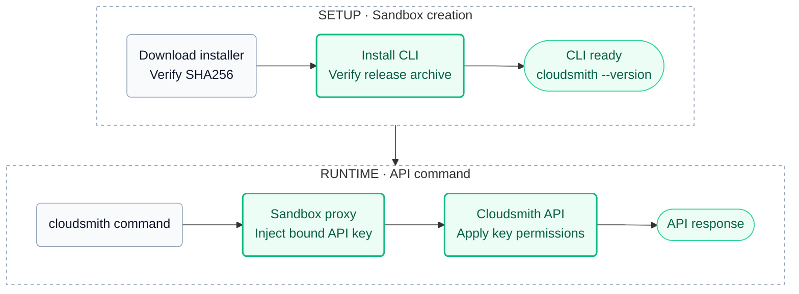

# cloudsmith-cli

Installs the [`cloudsmith` CLI](https://github.com/cloudsmith-io/cloudsmith-cli) and authenticates API requests through the sandbox proxy. Companion to [`cloudsmith-repo`](../cloudsmith-repo/README.md), which configures package downloads and does not add API access. Compose this kit only when the agent needs API operations such as listing, inspecting or publishing packages.

## Usage

Store the API key once (optional; without it the CLI installs and `cloudsmith whoami` reports no user):

```console
sbx secret set cloudsmith-api-key
```

Allow this repository as a kit source once, keeping any sources already allowed; see [Restrict kit sources](https://docs.docker.com/ai/sandboxes/customize/kits/#restrict-kit-sources):

```console
sbx settings set kit.allowedSources '["docker.io/","github.com/cloudsmith-io/cloudsmith-sbx-kits"]'
```

Create a sandbox, usually with the repository kit. This remote example requires
the referenced tags to exist in [Releases](https://github.com/cloudsmith-io/cloudsmith-sbx-kits/releases);
use the local example before the first release:

```console
sbx run claude \
  --kit "git+https://github.com/cloudsmith-io/cloudsmith-sbx-kits.git#ref=cloudsmith-repo-v0.1.0&dir=cloudsmith-repo" \
  --kit "git+https://github.com/cloudsmith-io/cloudsmith-sbx-kits.git#ref=cloudsmith-cli-v0.1.0&dir=cloudsmith-cli" \
  --kit-arg cloudsmith-repo.path=/acme/prod .
```

Pin every remote reference. Without `#ref=`, the kit resolves to whatever `main` holds at pull time.

Or from a local clone:

```console
sbx run claude --kit ./cloudsmith-cli/ .
```

Inside the sandbox:

```console
cloudsmith --version
cloudsmith whoami
cloudsmith list packages ORG/REPO
```

### Prerequisites

Use sbx 0.42.x (compatibility baseline: 0.42.1) and a Linux base image supported
by the Cloudsmith installer (`amd64` or `arm64`). The install step runs as root
and needs `sh`, `curl`, `sha256sum`, `awk`, `tar`, `gzip`, `mktemp` and CA
certificates. Standard Docker sandbox templates provide these tools.
The kit does not require Python or pip to install the standalone CLI.

Apply it at sandbox creation. Under organization governance, the organization
must allow the three hosts listed under [Why these domains](#why-these-domains).

## Arguments

`--kit-arg cloudsmith-cli.<name>=<value>`.

| Argument | Default | Value |
| --- | --- | --- |
| `cli-version` | `1.27.0` | A release number, or `latest` |

Keep the default or pin another release for reproducible installs. `latest`
resolves at install time even when the kit itself is pinned.

## Authentication

On first use, approve `api.cloudsmith.io` in the credential-binding prompt. For unattended runs, create the binding beforehand by running interactively once or configuring [credential bindings](https://docs.docker.com/ai/sandboxes/configuration/credentials/#credential-bindings). Without an approved binding, the API key is withheld.

The optional `cloudsmith-api-key` is stored on the host as shown in [Usage](#usage). The proxy adds `X-Api-Key: <key>` to requests to `api.cloudsmith.io`, from the CLI or any other process. Inside the sandbox, `CLOUDSMITH_API_KEY` holds `proxy-managed`.

Bind a least-privilege service-account key: every process in the sandbox can exercise its permissions. Without a key, the CLI still installs, but authenticated API operations are unavailable. API access is separate from the repository entitlement token used by `cloudsmith-repo`.

## How it works



- **Install.** The kit downloads Cloudsmith's [installer script](https://github.com/cloudsmith-io/cloudsmith-cli-install-script) (version and SHA256 pinned in the spec) to a file and checks the digest. The script fetches the release manifest for `cli-version` from the public `cloudsmith/cli` repository, verifies the archive against it, and installs under `/opt/cloudsmith-cli`. The kit symlinks `/usr/local/bin/cloudsmith`. Nothing is piped into `sh`, nothing comes from PyPI.
- **Bumping.** Installer: change `INSTALLER_VERSION` and `INSTALLER_SHA256` from its `SHA256SUMS`. CLI: change the `cli-version` default.

Installer staging uses a private temporary directory and is cleaned on success
or failure. The pinned installer verifies the CLI archive against its downloaded
manifest; that manifest is not a digest embedded in this kit. Kit signatures
do not independently authenticate that manifest or freeze `latest`.

### Why these domains

| Domain | Why |
| --- | --- |
| `api.cloudsmith.io` | Cloudsmith API, key added as `X-Api-Key` |
| `dl.cloudsmith.io` | Installer script, release manifest and CLI archive from Cloudsmith's public repositories |
| `cloudsmith-package-uploads-prd.s3-accelerate.amazonaws.com` | Pre-signed file uploads requested by `cloudsmith push`; no API-key injection |

`dl.cloudsmith.io` is a literal so the install works when the pull kit uses a custom download domain. It is shared by every public Cloudsmith repository.

`cloudsmith push` obtains a pre-signed upload URL from the API, uploads the
file to the Cloudsmith-owned S3 bucket, then asks the API to create the
package. The API key is injected only at `api.cloudsmith.io`, not at S3.
Publish only when the bound key has the required repository permissions.
Native `docker push` is a separate registry-authentication flow and is not
configured by this kit.

## Troubleshooting

| Symptom | Cause | Fix |
| --- | --- | --- |
| `cloudsmith whoami` shows no user or an authentication error | No working key is bound | Run `sbx secret set cloudsmith-api-key` interactively on the host, approve the binding, then recreate |
| CLI commands fail to connect | `api.cloudsmith.io` denied by a policy above the kit | `sbx policy log <sandbox>` |
| Install step exits 1 | Download or checksum failure, or `cli-version` does not exist | `sbx policy log <sandbox>`; check the version under `https://dl.cloudsmith.io/public/cloudsmith/cli/` |
| `cloudsmith push` fails during file upload | Upload host denied by organization or sandbox policy | Check `sbx policy log <sandbox>` for the exact host; keep pre-signed URLs out of reports |

## Cleanup

```console
sbx secret rm cloudsmith-api-key -f
```

Only remove the host secret if no other sandbox needs it. `/opt/cloudsmith-cli`
disappears with `sbx rm <sandbox>`. Neither operation revokes the API key in
Cloudsmith; revoke it separately when it is no longer needed.
