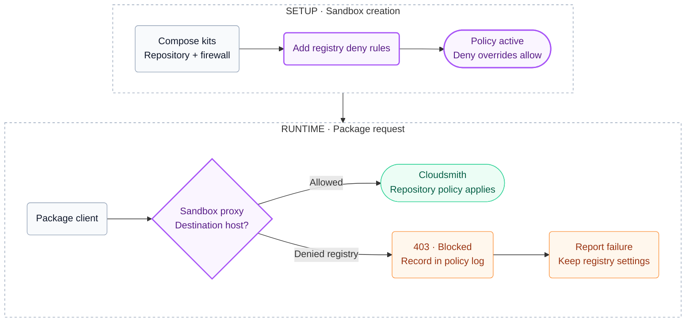

# cloudsmith-dependency-firewall

Denies the listed public package registry hosts at the sandbox proxy: PyPI,
npm, the Go mirror, crates.io, Maven Central, nuget.org and Docker Hub.
Compose it with [`cloudsmith-repo`](../cloudsmith-repo/README.md) to block
fallback to those hosts. This is not an exclusive Cloudsmith allowlist.
No arguments, credentials, client configuration or install steps.

## Usage

Allow this repository as a kit source once, keeping any sources already allowed; see [Restrict kit sources](https://docs.docker.com/ai/sandboxes/customize/kits/#restrict-kit-sources):

```console
sbx settings set kit.allowedSources '["docker.io/","github.com/cloudsmith-io/cloudsmith-sbx-kits"]'
```

Compose it with `cloudsmith-repo`. This remote example requires the referenced
tags to exist in [Releases](https://github.com/cloudsmith-io/cloudsmith-sbx-kits/releases);
use the local example before the first release:

```console
sbx run claude \
  --kit "git+https://github.com/cloudsmith-io/cloudsmith-sbx-kits.git#ref=cloudsmith-repo-v0.1.0&dir=cloudsmith-repo" \
  --kit "git+https://github.com/cloudsmith-io/cloudsmith-sbx-kits.git#ref=cloudsmith-dependency-firewall-v0.1.0&dir=cloudsmith-dependency-firewall" \
  --kit-arg cloudsmith-repo.path=/acme/prod .
```

Pin every remote reference. Without `#ref=`, the kit resolves to whatever `main` holds at pull time.

Or from a local clone:

```console
sbx run claude --kit ./cloudsmith-repo/ --kit ./cloudsmith-dependency-firewall/ --kit-arg cloudsmith-repo.path=/acme/prod .
```

Inside the sandbox, a public registry is blocked and the same install works through Cloudsmith:

```console
curl -sS -o /dev/null -w '%{http_code}\n' https://pypi.org/simple/     # 403
pip download --no-deps -d /tmp <package-in-the-repo>                   # served by Cloudsmith
```

On the host, `sbx policy log <sandbox>` shows `pypi.org` as `denied: rule "kit:<sandbox>:deny"`.

Use sbx 0.42.x (compatibility baseline: 0.42.1). Apply this kit when creating
a sandbox; `sbx kit add` does not support deny rules, so recreate an existing
sandbox to add it. Organization governance can further restrict access and
does not remove these denies.

## How it works

This kit takes no arguments and carries no credentials. Configure the repository and its authentication through `cloudsmith-repo` using the [usage examples](#usage). The flow below shows the named registry hosts this kit denies and the Cloudsmith hosts allowed by the composed policy; other hosts remain subject to that policy.



- **Deny wins.** `permissions.network.deny` beats any `allow` from the base agent or another kit, and lists only append across kits. A stale lockfile, a project `.npmrc` or a `--index-url` flag hits a policy block instead of a public registry.
- **Separate on purpose.** `cloudsmith-repo` alone is a redirect; the public registries stay reachable if the base agent allows them. This kit removes that network path. Adopt the redirect first, add enforcement with one extra `--kit`.
- **Agent note** (`kits-memory/cloudsmith-dependency-firewall.md`, next to the agent's memory file): report a package that cannot be installed (ecosystem, name, version, host, status) instead of changing registry settings or fetching from a URL.

### What it does not block

sbx policy is per hostname. The kit blocks the named endpoints, not "everything except one repository":

- Other repositories on a shared Cloudsmith host such as `dl.cloudsmith.io`. Custom domains can reduce that scope but are not a replacement for repository-scoped authorization.
- Anything the base agent or another kit allows: GitHub archives, `go get` with `GOPROXY=direct`, apt mirrors, ecosystems the pull kit does not configure (RubyGems, Conda, Composer, Hex).
- Warm local caches (`~/.npm`, `GOMODCACHE`, `~/.cargo/registry`).

Docker Hub is denied too, so `docker run alpine` inside the sandbox fails unless the image is mirrored in Cloudsmith, and kits whose startup pulls from Docker Hub (for example `qemu`) break.

To deny more hosts, add rules on the host with `sbx policy deny network <host>` (add `--sandbox <name>` to scope them) or fork the kit and extend `permissions.network.deny`.

### Composing with other kits

Deny wins over every kit's allowlist, so kits that fetch from a public registry during install or startup change behavior:

- Kits whose install steps fetch from PyPI or npm's public registry need compatible repository settings and upstreams. List `cloudsmith-repo` first. Explicit registry flags, direct URLs and per-project settings can still conflict, so check the versions of the kits you compose rather than assuming every `npm install` or `pip install` will work.
- Kits that pull images from Docker Hub (`qemu`, `openclaw`, `nanoclaw`) break. Image names are not redirected; mirror the images in Cloudsmith or leave the firewall out.
- Runtime `npx` launchers (`claude-acp`, `codex-acp`) work only with `cloudsmith-repo` composed.
- `packages-through-sfw` (in docker/sbx-kits-contrib) replaces the `npm` and `pip` binaries with shims; stacking it with these kits is untested.

### Why these domains

The kit allows nothing. It denies:

| Denied | Why |
| --- | --- |
| `pypi.org`, `files.pythonhosted.org` | PyPI index and file host |
| `registry.npmjs.org`, `registry.npmjs.com`, `registry.yarnpkg.com` | npm registry, the `.com` alias Cloudsmith redirects unknown packages to, Yarn classic's default |
| `proxy.golang.org` | Go module mirror |
| `index.crates.io`, `static.crates.io`, `crates.io` | crates.io index, downloads, legacy site |
| `repo1.maven.org`, `repo.maven.apache.org` | Maven Central |
| `api.nuget.org`, `www.nuget.org`, `globalcdn.nuget.org`, `azuresearch-usnc.nuget.org`, `azuresearch-ussc.nuget.org` | nuget.org v3 feed, legacy v2 feed, download CDN, search hosts |
| `registry-1.docker.io`, `auth.docker.io`, `production.cloudfront.docker.com`, `production.cloudflare.docker.com`, `index.docker.io` | Docker Hub registry, token endpoint, both blob CDN names, legacy index |

## Cleanup

Nothing on the host. The deny rules disappear with `sbx rm <sandbox>`. Rules added with `sbx policy deny network` are removed with `sbx policy rm`.
