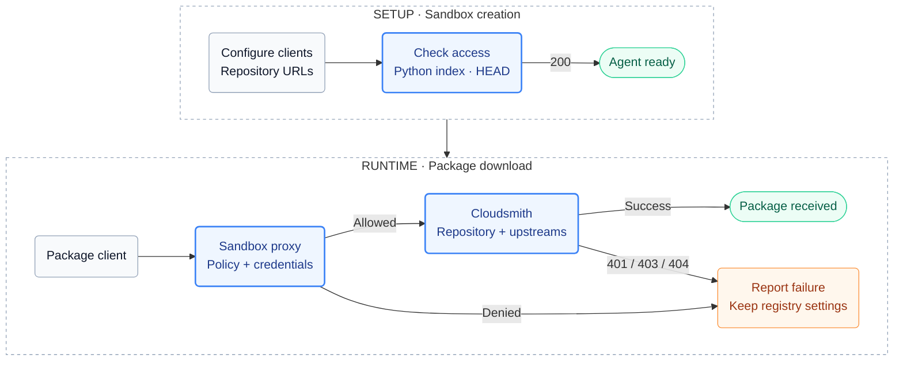

# cloudsmith-repo

Configures pip/uv, npm/pnpm/Yarn, Go, Cargo, Maven and NuGet to use a [Cloudsmith](https://cloudsmith.com) repository. Docker and raw downloads use explicit Cloudsmith URLs; the kit does not rewrite image names or download commands. Cloudsmith applies the repository's configured policies. The sandbox proxy authenticates requests using a read-only [entitlement token](https://docs.cloudsmith.com/software-distribution/entitlement-tokens) stored on the host.

Companions: [`cloudsmith-cli`](../cloudsmith-cli/README.md) (the `cloudsmith` command and an API key), [`cloudsmith-dependency-firewall`](../cloudsmith-dependency-firewall/README.md) (deny the public registries).

## Usage

Store the repository's entitlement token once (skip for a public repository):

```console
sbx secret set cloudsmith-entitlement-token
```

Create a sandbox pointed at the repository:

```console
sbx run claude --kit ./cloudsmith-repo/ --kit-arg cloudsmith-repo.path=/acme/prod .
```

For the released kits, the `kit.allowedSources` setting, the release tags and
signature verification, see
[Use a released kit](../README.md#use-a-released-kit).

Approve the configured Cloudsmith hosts in the
[credential-binding](../README.md#credential-bindings) prompt. Without an
approved binding, private repository access fails.

Prerequisites:

- The repository has [upstreams](https://docs.cloudsmith.com/repositories/upstreams) for the formats in use. Without them it serves only the packages you pushed.
- List this kit before kits whose install runs `npm` or `pip`; their installs then go through the repository. `bun` is not configured.
- The base image provides `sh`, `curl`, Node.js and `npm`, an `agent` user at UID 1000, and `/home/agent`. The kit configures package clients but does not install them. Add any missing language toolchains to your base image.
- The kit owns `~/.cargo/config.toml`, `~/.m2/settings.xml`, `~/.nuget/NuGet/NuGet.Config` and `~/.yarnrc.yml`; its bundled files replace existing content. It also sets `registry` in the agent's `~/.npmrc` and keeps the other entries.

See [Quick start](../README.md#quick-start) for the sbx version, sandbox
recreation and the organization-governance rule.

## Arguments

`--kit-arg cloudsmith-repo.<name>=<value>`. The kit substitutes values textually, so each pattern also keeps shell metacharacters out.

| Argument | Default | Value |
| --- | --- | --- |
| `path` | `/cloudsmith/cli` | `/ORG/REPO` on `*.cloudsmith.io`; `/REPO` on a namespace-level [custom domain](https://docs.cloudsmith.com/workspaces/custom-domains); empty on a repository-level one |
| `dl-host` | `dl.cloudsmith.io` | Download host: Python index, raw, Maven, NuGet packages, and every blob redirect |
| `redirect-host` | `dl.cloudsmith.io` | Additional authenticated download host for blob redirects and NuGet resources on a custom domain |
| `npm-host` | `npm.cloudsmith.io` | npm registry |
| `go-host` | `golang.cloudsmith.io` | Go module proxy and checksum database |
| `cargo-host` | `cargo.cloudsmith.io` | Cargo sparse index |
| `nuget-host` | `nuget.cloudsmith.io` | NuGet v3 feed |
| `docker-host` | `docker.cloudsmith.io` | Docker registry |

The default `path` is Cloudsmith's public CLI repository. It is a smoke-test default, not a general-purpose dependency mirror. Set it for your project.

Paths accept lowercase letters, digits and interior hyphens, with no trailing
slash. Hosts are bare DNS names, without `https://`, ports or paths. Do not put
credentials in arguments.

### Repositories with custom download domains

Cloudsmith can return pre-signed blob URLs on the organization's primary
download domain even when a client requests metadata from `*.cloudsmith.io`.
Keep the standard format hosts and `/ORG/REPO` path, and allow that redirect
host with `redirect-host`:

```console
sbx run claude --kit ./cloudsmith-repo/ \
  --kit-arg cloudsmith-repo.path=/acme/prod \
  --kit-arg cloudsmith-repo.redirect-host=dl.acme.com .
```

This also works when the organization has custom domains at different levels
or only for some formats. Approve the extra host in the entitlement-token
binding: NuGet resource URLs on that host need authentication even though
other formats use pre-signed blobs. Obtain the hostname from the repository's
setup page or a blocked-host entry in `sbx policy log`; do not copy signed
URLs into logs or configuration.

To use custom hosts for the metadata endpoints too, they must all use the
same path level. Set `path` to the shorter form and override the six format
hosts. Also set `redirect-host` to the primary download domain:

```console
sbx run claude --kit ./cloudsmith-repo/ \
  --kit-arg cloudsmith-repo.path=/prod \
  --kit-arg cloudsmith-repo.redirect-host=dl.acme.com \
  --kit-arg cloudsmith-repo.dl-host=dl.acme.com --kit-arg cloudsmith-repo.npm-host=npm.acme.com \
  --kit-arg cloudsmith-repo.go-host=go.acme.com --kit-arg cloudsmith-repo.cargo-host=cargo.acme.com \
  --kit-arg cloudsmith-repo.nuget-host=nuget.acme.com --kit-arg cloudsmith-repo.docker-host=docker.acme.com .
```

For repository-level custom domains, pass `--kit-arg cloudsmith-repo.path=`
and override all six hosts with the repository-level names.

## Supported formats

`<dl>`, `<npm>`, `<go>`, `<cargo>`, `<nuget>` and `<docker>` stand for the host arguments, `<path>` for the `path` argument. No setting contains a credential. The proxy adds it.

| Format | Tools | Configured by | Repository URL | Check inside the sandbox |
| --- | --- | --- | --- | --- |
| Python | pip, uv | `PIP_INDEX_URL`, `UV_DEFAULT_INDEX`, `PIP_NO_INPUT=1` | `https://<dl>/basic<path>/python/simple/` | `pip download --no-deps -d /tmp <pkg>` |
| npm | npm, Yarn Classic, Yarn Berry, pnpm | `NPM_CONFIG_REGISTRY`, `YARN_NPM_REGISTRY_SERVER`, `~/.npmrc` (pnpm), `~/.yarnrc.yml` (Yarn Berry proxy) | `https://<npm><path>/` | `npm pack <pkg>@<version> --ignore-scripts` |
| Go | go | `GOPROXY` (no `,direct`) | `https://<go><path>/` | `GONOSUMDB=<prefix> go get <module>@<ver>` |
| Cargo | cargo | `~/.cargo/config.toml` (crates.io replaced), dummy `CARGO_REGISTRIES_CLOUDSMITH_TOKEN` | `sparse+https://<cargo><path>/` | `cargo add <crate> && cargo fetch` |
| Maven | mvn | `~/.m2/settings.xml` (`mirrorOf *`) | `https://<dl>/basic<path>/maven/` | `mvn -q dependency:resolve` |
| NuGet | dotnet | `~/.nuget/NuGet/NuGet.Config` (`<clear/>`, one source) | `https://<nuget><path>/v3/index.json` | `dotnet restore` |
| Docker | docker | nothing; host is in the image name | `<docker><path>/<image>:<tag>` | `docker pull <docker><path>/<image>:<tag>` |
| Raw | curl | nothing | `https://<dl>/basic<path>/raw/names/<n>/versions/<v>/<file>` | `curl -fsSL -o f <url>` |

Per-format notes:

- **Python**: pip prints "No matching distribution found" for both 401 and 404; `pip -vvv` shows the status. uv reports 401, 403 and 404 distinctly.
- **npm**: quarantine is `E403 Package is quarantined`; `npm view` still lists the version. A project `.npmrc` with `@scope:registry=` wins over the env var.
- **Yarn Berry**: does not use `HTTPS_PROXY` by default. The bundled `~/.yarnrc.yml` maps Yarn's proxy settings to the sandbox-managed environment variables. Project settings that override these proxy values can prevent credential injection.
- **Go**: the Go host can answer 404 for a bad token or path. Private modules need `GONOSUMDB=<prefix>`. `GOPRIVATE` also defaults `GONOPROXY`, which bypasses Cloudsmith; if a project already uses it, set `GONOPROXY=none` to retain the configured module proxy. Keep checksum verification enabled for public modules.
- **Cargo**: cargo needs some local token when the registry says `auth-required`; the kit sets a dummy and the proxy replaces the header.
- **Maven**: uses the download host mirror (`/basic<path>/maven/`). sbx supplies Java proxy properties through `JAVA_TOOL_OPTIONS`; preserve that variable so Maven uses the credential-injecting forward proxy. `HTTPS_PROXY` alone is not sufficient for Java clients outside the sandbox.
- **NuGet**: a 401 surfaces as `NU1301` on `repository-signatures/5.0.0/index.json`.
- **Docker**: pull only, using Cloudsmith-qualified image names. The proxy injects the CLI kit's API credential only at `api.cloudsmith.io`; that credential does not enable `docker push` or registry login.
- **Raw**: pin versions. `versions/latest/` redirects with the entitlement token in the URL (see Security).

Not configured: Bun, RubyGems, Conda, Composer, Hex, Dart, Swift, Conan, Terraform, apt or rpm. Do not assume their authentication or routing works without a separate integration.

## Authentication

Private repositories use the `cloudsmith-entitlement-token` stored in the [usage steps](#usage); public repositories need no token. The sandbox proxy adds `Authorization: Bearer <token>` to requests to the configured Cloudsmith hosts. Inside the sandbox, `CLOUDSMITH_ENTITLEMENT_TOKEN` holds `proxy-managed`, and Cargo uses a placeholder token.

Use a read-only token scoped to the repository. See [Security](#security) for the raw-download redirect limitation and token rotation guidance.

## How it works



- **Probe.** The first install step sends `HEAD` to the Python index through the proxy. Anything but 200 stops creation: 401 (no token reached Cloudsmith), 403 (token rejected, or host denied by policy), 404 (wrong `path` for the domain level). It checks the download host only.
- **Policy.** A download blocked by a [vulnerability](https://docs.cloudsmith.com/policy-management/vulnerability-policy), license or deny policy returns 403. Scanning and cache invalidation are asynchronous; do not treat a successful download as proof that policy evaluation has completed.
- **Agent note** (`kits-memory/cloudsmith-repo.md`, next to the agent's memory file): report failures with package, version, host and status; never switch a tool to a public registry.
- **Scope.** sbx policy is per hostname. This kit allows hosts and configures clients; it does not prove every artifact came from the repository (pre-installed tools, caches, hosts other kits allow). For blocking the public registries, compose [`cloudsmith-dependency-firewall`](../cloudsmith-dependency-firewall/README.md).

### Why these domains

`permissions.network.allow` declares the format hosts and the redirect host.
Use the format checks above with your repository and inspect
`sbx policy log <sandbox>` before adopting a new domain configuration.

| Domain | Why |
| --- | --- |
| `<dl-host>` | Python index and wheels, raw, Maven, NuGet packages, and the pre-signed `/signed/...` redirects for npm, Go, cargo and Docker blobs |
| `<redirect-host>` | Custom primary download domain for blob redirects and authenticated NuGet resources |
| `<npm-host>` | npm metadata |
| `<go-host>` | Go module proxy and proxied `sum.golang.org` |
| `<cargo-host>` | Cargo sparse index |
| `<nuget-host>` | NuGet v3 service index, signatures, registration |
| `<docker-host>` | Docker registry `/v2/` |

Not added by this kit: `sum.golang.org` (proxied by Cloudsmith),
`python.cloudsmith.io` or `api.cloudsmith.io` (added by `cloudsmith-cli`).
Other kits can allow them. Many Cloudsmith repositories share
`dl.cloudsmith.io`; host-level policy cannot narrow it to one.

## Security

Use a read-only, repository-scoped token, one per trust context. A raw
`versions/latest/<file>` request returns a 302 whose `Location` contains that
token, and the kit cannot block a single URL, so pin raw downloads to a
version. See [Known Limits](../SECURITY.md#known-limits) for the full list and
[Rotating a Credential](../SECURITY.md#rotating-a-credential) for the rotation
order.

## Troubleshooting

| Symptom | Cause | Fix |
| --- | --- | --- |
| `sbx create` fails at the first install step with `exit 1` | Probe did not get 200; sbx hides the output and rolls the sandbox back | Create with `--name`, read `[cloudsmith-repo]` in the sandboxd daemon log, and `sbx policy log <name>` (survives the rollback) |
| Probe 401 | No working token reached Cloudsmith, or you did not approve the binding | Run `sbx secret set cloudsmith-entitlement-token` interactively on the host, approve the binding, then recreate |
| Probe 403 | Token not valid for this repository, or `dl-host` denied by policy | Check `sbx policy log <name>` first, then the token's scope and status in Cloudsmith; do not paste tokens into command arguments |
| Probe 404 | Wrong `path` for the domain level | `/ORG/REPO`, `/REPO` or empty |
| Maven cannot authenticate or connect | The launcher discarded sandbox Java proxy settings | Preserve the sandbox-managed `JAVA_TOOL_OPTIONS`; inspect `sbx policy log <name>` |
| Metadata works, downloads blocked on `dl.<custom>` | Cloudsmith returns downloads on its custom domain | Set `cloudsmith-repo.redirect-host` to that hostname and approve its credential binding; keep standard format hosts and `/ORG/REPO` |
| Yarn Berry returns 401 while npm works | Yarn bypassed the forward proxy | Retain the kit's `.yarnrc.yml` proxy settings and check for `transparent` requests in `sbx policy log` |
| 403 with "quarantined" | Repository policy | Check the package in Cloudsmith; do not use a public registry |
| 404 for a package that exists publicly | No upstream for that format | Add a Cache and Proxy upstream |

## Cleanup

```console
sbx secret rm cloudsmith-entitlement-token -f
```

Config files inside the sandbox disappear with `sbx rm <sandbox>`; files in your
mounted project remain. See
[Credential bindings](../README.md#credential-bindings) for the rules on
removing a shared host secret.
